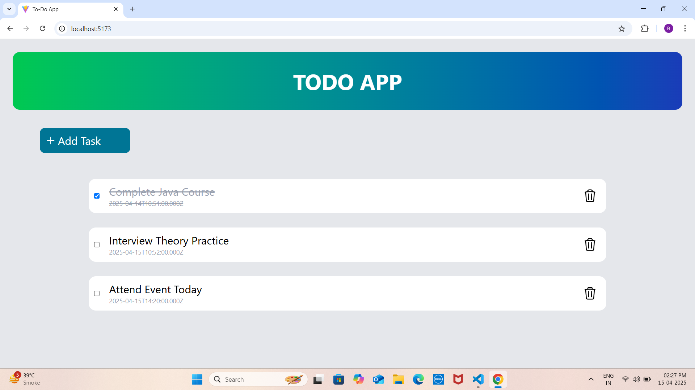
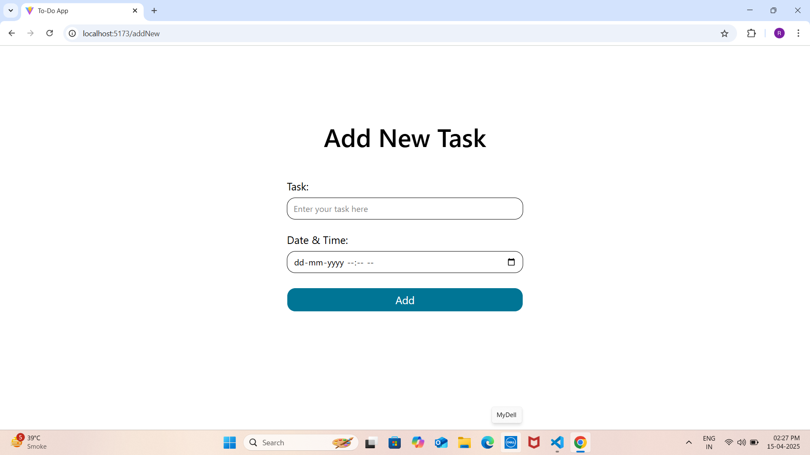

# ToDo App 
A full-stack To-Do Management Application built with React (frontend) and Spring Boot (backend), connected to a MySQL database.

---

## Features
- Add new tasks with name and date/time
- Mark tasks as complete / incomplete (toggle)
- Delete tasks
- Store tasks persistently in MySQL
- Clean UI built with Tailwind CSS

---

## Tech Stack 
 **Frontend:**
  - React
  - Tailwind CSS
  - Axios (for API calls)
  - React Router

 **Backend**
  - Spring Boot
  - Spring Data JPA (Hibernate)
  - MySQL
  - REST API

---

## Screenshots
- **Homepage:**

- **Add New Task page:**

